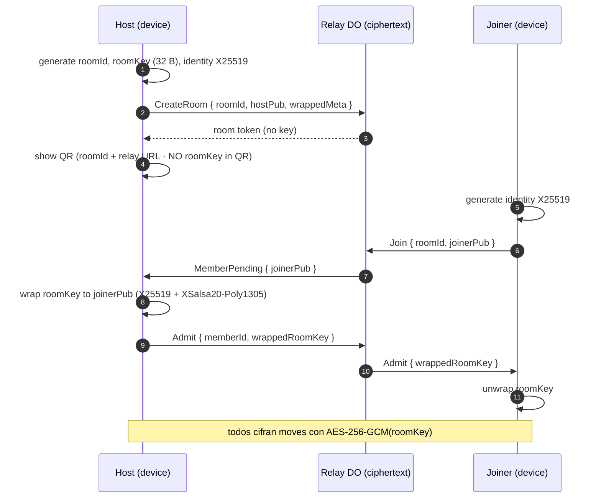

# R.A.D.A.R. El Polijuego® · Fase 1 — Arquitectura

**Estado:** propuesta técnica (no ship App Store / Play). Decider: Rö.  
**Fecha:** 2026-08-22  
**Decider 2026-08-22:** **1 app = R.A.D.A.R. El Polijuego®.** No mega-binario UX Tools.  
**Repos:** `vientonorte/uxtools` (suite web) · nativo = `apps/polijuego`, no `mi-portafolio`.  
**Live hoy:** [PoliRadar web](https://vientonorte.github.io/uxtools/app.html#/poliradar) = login opcional + QR + **embed Figma Site**. Self Radar = `localStorage` en claro.

Este documento reemplaza el iframe como producto. El Figma Site queda prototipo de referencia visual, no runtime.

---

## 0. Hechos (no supuestos)

| Superficie | Qué es hoy |
|------------|------------|
| `src/pages/Polijuego.tsx` | Shell: fullscreen, QR, `PoliradarLogin`, iframe `https://trill-scheme-71219616.figma.site/` |
| `src/types/metodo-ro.ts` | Self Radar **Método Ro**: 7 ejes personales (incluye `camila`) + Kit TLP |
| `src/lib/metodo-ro-storage.ts` | Validación + `localStorage`. Sin cifrado, sin red |
| `supabase/migrations/20260822120000_poli_players.sql` | `poli_players` 1:1 con `auth.users`. RLS. **Cero tablero, cero cartas** |
| i18n | ES / EN / PT en `onboarding-i18n.ts` |
| Tokens | Navy `#001A72` · cyan `#00B5E2` (SURA/suite). El brief pide violeta/neón: **skin RADAR**, no romper tokens de Benchmark |

Nombre que no se mezcla:

| Id | Producto | Datos |
|----|----------|-------|
| `selfradar` | Review semanal Método Ro (7 ejes) | Ya shipped web |
| `radar.solo` | Modo individual del **juego** (chequeo de cartas) | A construir |
| `radar.passplay` | 2 personas, un dispositivo | A construir |
| `radar.room` | Sala remota E2EE | A construir |

Copy in-app puede decir “SelfRadar” para el modo solo. El **schema** usa `radar_solo_*` para no chocar con sesiones Método Ro.

Ejes `camila` / nombres reales **no** van a App Store. Self Radar público usa labels genéricos (`vinculo_primario`, no un nombre propio).

---

## 1. Decisión de stack

**Elegido: React Native (Expo) + TypeScript · New Architecture · Reanimated 3 + Gesture Handler.**

| Criterio | React Native / Expo | Flutter |
|----------|---------------------|---------|
| Dominio ya en TS (`SelfradarSession`, i18n, suite) | Comparte `packages/domain` | Reescribir |
| IAP StoreKit 2 + Play Billing | `expo-iap` / `react-native-iap` maduro | `in_app_purchase` + glue extra |
| E2EE (WebCrypto / libsodium) | Misma lib en mobile + web | FFI / duplicate |
| 60/120 FPS drag-and-drop | Worklets en UI thread | Impeller, también válido |
| Suite UX Tools (web + nativo) | Un lenguaje | Dos runtimes |
| Apple 5.1.1 account deletion | Sign in with Apple + endpoint propio | Igual, más costo |

Flutter no está descartado para un prototipo de tablero si Impeller gana en un spike de 3 días. El **producto** se implementa en RN para no romper la suite.

Clean Architecture:

```text
apps/polijuego/             Expo 53 · RN 0.81+ · New Arch · Store listing
  app/                      pantallas, a11y, tema violeta/neón
packages/radar-domain/      puro TS: ciclo RADAR, mazos, lanes, entitlements
packages/radar-crypto/      X25519 + AES-256-GCM wrap (WebCrypto / sodium)
packages/radar-storage/     SQLCipher (op-sqlite) + Keystore/Keychain
packages/radar-realtime/    cliente Durable Object · solo ciphertext
packages/radar-billing/     StoreKit 2 / Play Billing · restore
workers/radar-relay/        Cloudflare Worker + Durable Object (relay E2EE)
workers/radar-license/      validación IAP · flags · account deletion
```

Estado de UI: **Zustand** (sesión de tablero) + **TanStack Query** (entitlements). No Redux. No BLoC. El dominio no importa React.

Offline-first: el tablero vive en SQLCipher. La red solo existe para salas Pro y para restore de licencia.

---

## 2. Capas y límites de confianza

```text
┌─────────────────────────────────────────────────────────────┐
│  Device (TRUSTED)                                           │
│  Keychain/Keystore → DB_KEY (256-bit)                       │
│  SQLCipher (AES-256) → sesiones, acuerdos, reflexiones      │
│  libsodium: identity X25519 (no sale en claro)              │
│  Entitlements cache (firmado)                               │
└───────────────┬───────────────────────────┬─────────────────┘
                │ ciphertext only           │ Apple/Google receipt
                ▼                           ▼
┌───────────────────────────┐   ┌─────────────────────────────┐
│  radar-relay (UNTRUSTED)  │   │  radar-license (UNTRUSTED)  │
│  Durable Object / sala    │   │  transaction_id → flags     │
│  blob opaco + membership  │   │  ZERO session content       │
│  no plaintext, no logs    │   │  Sign in with Apple sub     │
└───────────────────────────┘   └─────────────────────────────┘
```

**Zero-knowledge de contenido:** el relay no puede leer cartas ni notas. El license server no ve el tablero. Crash reports (opt-in) strippean payloads.

**No hay:** AdMob, Meta SDK, Firebase Analytics, Amplitude, GTM, `gtag`.  
Crashes: Sentry **off** por defecto; si Decider lo prende, `beforeSend` borra `extra`/`breadcrumbs` de sesión.

---

## 3. Flujo E2EE (salas remotas)

Modelo: **room wrapping key** (no Double Ratchet). Una sala de facilitación es efímera (horas). Quien está en la sala ya ve las cartas. Forward secrecy = rotar `roomKey` en join/leave.

### 3.1 Join



El QR **nunca** lleva `roomKey`. Si el QR filtrara la key, cualquiera con foto del teléfono entra. Admisión es un tap del host (Pass & Play no usa relay).

### 3.2 Move (carta → lane)

```text
plaintext Move {
  v: 1,
  sessionId, cardId, from: LaneId | "deck" | "hand",
  to: LaneId | "hand",
  actorSeat, ts, prevHash
}
ciphertext = AES-256-GCM(roomKey, Move, aad = roomId || seq)
relay stores { seq, ciphertext, nonce }  TTL 24h  then wipe
```

`prevHash` = SHA-256 del ciphertext anterior → detecta replay/fork. El relay no valida el hash (no puede); cada cliente lo verifica y muestra “desync” si falla.

### 3.3 Membership rotate

Al admitir o expulsar: host genera `roomKey'`, re-wrap a miembros actuales, emite `KeyRotate` cifrado con la key **vieja**. Miembros aplican y olvidan la key vieja. Relay no retiene keys.

### 3.4 Cierre / purge

Host o cualquier miembro: `CloseRoom`. Relay borra el DO state. Clientes: las notas **locales** quedan en SQLCipher hasta que el usuario purga (Fase 5). No hay “nube de acuerdos” salvo export explícito.

WebRTC datachannel es **optimización** (Fase 3b): mismo `roomKey`, menos latencia. El DO siempre es fallback. No se persiste media.

---

## 4. Esquema SQLCipher (dispositivo)

Una DB por instalación. Clave en iOS Keychain (`kSecAttrAccessibleAfterFirstUnlockThisDeviceOnly`) / Android Keystore (AES-GCM, no exportable). SQLCipher `cipher_page_size=4096`, `kdf_iter=256000`.

```sql
-- packages/radar-storage/schema.sql  (v1)

PRAGMA cipher_memory_security = ON;
PRAGMA foreign_keys = ON;

CREATE TABLE kv (
  k TEXT PRIMARY KEY,
  v BLOB NOT NULL,
  updated_at INTEGER NOT NULL
);

CREATE TABLE identity (
  id TEXT PRIMARY KEY,               -- 'local'
  x25519_sk_wrapped BLOB NOT NULL,   -- wrap con DB_KEY (defense in depth)
  x25519_pk BLOB NOT NULL,
  created_at INTEGER NOT NULL
);

CREATE TABLE entitlements (
  product_id TEXT PRIMARY KEY,       -- radar.pro | vn.suite.lifetime
  source TEXT NOT NULL,              -- apple | google | restore
  transaction_id TEXT NOT NULL,
  granted_at INTEGER NOT NULL,
  expires_at INTEGER,                -- NULL = lifetime / non-consumable
  raw_jws BLOB                       -- opcional, para restore offline
);

CREATE TABLE decks (
  id TEXT PRIMARY KEY,
  slug TEXT NOT NULL UNIQUE,         -- base | expansion.*
  locale TEXT NOT NULL,
  title TEXT NOT NULL,
  is_base INTEGER NOT NULL DEFAULT 1,
  payload_json TEXT NOT NULL         -- cartas canónicas (no íntimas)
);

CREATE TABLE sessions (
  id TEXT PRIMARY KEY,
  kind TEXT NOT NULL,                -- solo | passplay | room
  locale TEXT NOT NULL DEFAULT 'es',
  cycle_step TEXT NOT NULL,          -- rev | aco | deb | acc | rec
  created_at INTEGER NOT NULL,
  updated_at INTEGER NOT NULL,
  closed_at INTEGER,
  room_id TEXT,                      -- NULL si local
  title TEXT NOT NULL DEFAULT ''
);

CREATE TABLE seats (
  session_id TEXT NOT NULL REFERENCES sessions(id) ON DELETE CASCADE,
  seat INTEGER NOT NULL,             -- 0 = host/self, 1 = partner (passplay)
  display_name TEXT NOT NULL DEFAULT '',
  color TEXT NOT NULL,
  is_local INTEGER NOT NULL DEFAULT 1,
  PRIMARY KEY (session_id, seat)
);

CREATE TABLE cards (
  id TEXT PRIMARY KEY,
  session_id TEXT NOT NULL REFERENCES sessions(id) ON DELETE CASCADE,
  deck_id TEXT NOT NULL,
  card_key TEXT NOT NULL,            -- id estable del mazo
  lane TEXT NOT NULL,                -- deck | hand | do | later | talk | drop
  seat INTEGER,                      -- dueño de la mano; NULL en lanes
  sort_key REAL NOT NULL,
  note TEXT NOT NULL DEFAULT '',     -- reflexión / acuerdo (íntimo)
  updated_at INTEGER NOT NULL
);
CREATE INDEX cards_session_lane ON cards(session_id, lane, sort_key);

CREATE TABLE agreements (
  id TEXT PRIMARY KEY,
  session_id TEXT NOT NULL REFERENCES sessions(id) ON DELETE CASCADE,
  body TEXT NOT NULL,
  due_at INTEGER,                    -- Pro: calendar
  calendar_event_id TEXT,
  created_at INTEGER NOT NULL
);

CREATE TABLE audit_events (
  id INTEGER PRIMARY KEY AUTOINCREMENT,
  ts INTEGER NOT NULL,
  kind TEXT NOT NULL,                -- create | export | purge | room_close | iap
  detail_json TEXT NOT NULL          -- sin contenido de cartas
);

CREATE TABLE selfradar_sessions (
  -- Método Ro · copy sanitizada (sin ejes con nombres propios)
  id TEXT PRIMARY KEY,
  created_at INTEGER NOT NULL,
  updated_at INTEGER NOT NULL,
  week_from TEXT NOT NULL,
  week_to TEXT NOT NULL,
  scores_json TEXT NOT NULL,
  notes_json TEXT NOT NULL
);
```

Purge (Fase 5): `DELETE` + `VACUUM` + rotar `DB_KEY` + borrar Keychain + `CloseRoom` de salas abiertas. Eso satisface App Store 5.1.1 y Play Data Safety “user-requested deletion”.

---

## 5. Monetización (3 tiers) — modelo de licencia

| Tier | Product ID | Tipo | Desbloquea |
|------|------------|------|------------|
| 1 Free | — | — | `radar.solo`, `radar.passplay`, mazo `base`, 4 lanes |
| 2 Pro App | `radar.pro` | Non-consumable | salas remotas ilimitadas, mazos expansión, export acuerdos, calendar |
| 3 Lifetime Suite | `vn.suite.lifetime` | Non-consumable | En **esta** app = mismo que Pro. Otras apps VN futuras consultan el license server. No se meten Benchmark/UXFlow/Kit TLP en el binario Polijuego. |

**Riesgo App Review 3.1.1:** el listing es **R.A.D.A.R. El Polijuego®**, no “toda la suite adentro”. Lifetime no se vende como loot ni como suscripción encubierta. Copy: *compra única de la suite Viento Norte; esta app honra la licencia; apps VN nuevas la consultan*. Restore nativo (`StoreKit 2.sync` / `queryPurchases`) basta para *esta* app. Bundle: `io.vientonorte.polijuego`.

Free **no exige** login. Sign in with Apple / Google Play Games / Google es opt-in para restore cross-device.

El license Worker guarda:

```text
{ vendor, original_transaction_id, product_id, app_account_token, granted_at }
```

Nunca `session_id`, nunca notas.

---

## 6. a11y y tiendas (piso de ship)

- WCAG **2.2 AA** (canon VN; 2.1 queda subsumido). AAA de contraste en texto sobre violeta si el skin lo permite; no bloquear ship por AAA de non-text.
- VoiceOver / TalkBack en cada carta y lane (`accessibilityRole="button"`, live region al soltar).
- Drag: alternativa teclado/rotor “Mover a Hacer / Posponer / Discutir / Eliminar”.
- Dynamic Type hasta 200% sin recortar CTAs (Apple HIG).
- Account deletion in-app (5.1.1) = mismo flujo que Purge + revoke license.
- Privacy Nutrition / Data Safety: Data not collected. Opcional: User ID **solo** si hay Sign in with Apple (Account Info, not linked to intimate content).
- Restore Purchases visible en Settings (Guideline 3.1.1).

Rendimiento: Reanimated shared values para posición de carta; JS no corre por frame. Meta: 60 FPS A15 / Snapdragon 7; 120 Hz si `PixelRatio` + `refreshRate >= 120` y no Reduce Motion.

---

## 7. Amenazas (STRIDE corto)

| Amenaza | Mitigación |
|---------|------------|
| Relay lee cartas | No tiene `roomKey`. Ciphertext only. |
| QR leaked | QR sin key; host admite a mano. |
| Backup iCloud de DB | SQLCipher; clave `ThisDeviceOnly` → restore en otro device pide re-enrol. Export es acción explícita. |
| Screenshot en Pass & Play | Banner “esto queda en este teléfono”; iOS `isSecureTextEntry` no aplica a canvas — documentar. FLAG: `FLAG_SECURE` en Android en sesión activa. |
| IAP spoof | Validar JWS App Store Server API / Play Developer API en `radar-license`. Cliente trata grant local como cache. |
| Analytics leak | No hay SDK de ads/analytics. |
| Ejes con nombres reales | Schema público genérico. |

---

## 8. Relación con lo que ya está shipped

1. Web PoliRadar **sigue** como prototipo + QR hasta que el binario nativo pase Test (DS).
2. Self Radar **Método Ro** y Kit TLP quedan en `uxtools` web. No van en el binario Polijuego v1. El modo individual in-app es `radar.solo` (cartas), no los 7 ejes.
3. Self Radar web (`localStorage`) no se cifra retroactivamente en Pages. Si algún día hay app Self Radar, nace cifrada. Import web → nativo = acción explícita.
4. `poli_players` en Supabase **no** se usa para contenido. Si el relay es Cloudflare DO, Supabase Auth queda opt-in o se retira (Decider).
5. FO `mi-portafolio` / SEM `/s/consultoria` **no** se tocan. Este track es `uxtools` + app Polijuego, no consultoría.

---

## 9. Key Decisions

1. **RN + Expo lock 2026-08-22** (Decider: corte v1.0 store). No Flutter. Spike Impeller **no** entra en el camino a TestFlight.
2. **SQLCipher local** como SSOT de contenido íntimo.
3. **Room wrapping key + rotate on membership**, no MLS/Double Ratchet en v1.
4. **Relay Cloudflare Durable Object** (UNTRUSTED). Supabase no guarda tablero.
5. **Un binario = Polijuego** (Decider 2026-08-22). Bundle `io.vientonorte.polijuego`. Lifetime no mete la suite web dentro de esta app.
6. **Separar** Self Radar Método Ro vs RADAR Solo en schema.
7. **Cero trackers.** WCAG 2.2 AA. Reduce Motion respeta 120 Hz off.
8. Ship stores **solo** tras Fase 6 + ok Decider.

---

## 10. Open questions (Decider)

1. ~~¿Un app suite o RADAR aparte?~~ **Cerrado 2026-08-22: 1 app = Polijuego.**
2. ¿Retirar magic link Supabase del web al nacer el relay DO, o dejar web como prototipo?
3. ¿Skin violeta/neón solo en RADAR, tokens navy/cyan en el resto de la suite web?
4. ~~¿Spike Impeller o lock RN?~~ **Cerrado 2026-08-22: lock RN + Expo. Corte v1.0 = Fase 2 + esqueleto Fase 5. IAP no es día 1.**

---

Corte v1.0 en curso (2026-08-22): repo local `GitHub/polijuego` · Expo 57 · Fase 2 Free + purge. IAP no día 1.

## 11. PR Plan (repo `polijuego`)

| PR | Scope |
|----|--------|
| P0 | `packages/radar-domain` + schema SQL + tests de lanes/ciclo |
| P1 | SQLCipher adapter + Keystore wrap + purge stub |
| P2 | Tablero Free: solo + passplay + mazo base (Fase 2) |
| P3 | Worker relay + E2EE join/move (Fase 3) |
| P4 | IAP + restore + license Worker (Fase 4) |
| P5 | Privacy dashboard + export JSON/PDF + delete account (Fase 5) |
| P6 | Store listing, Data Safety, 5.1.1, perf pass (Fase 6) |

No merge a stores desde este doc.
